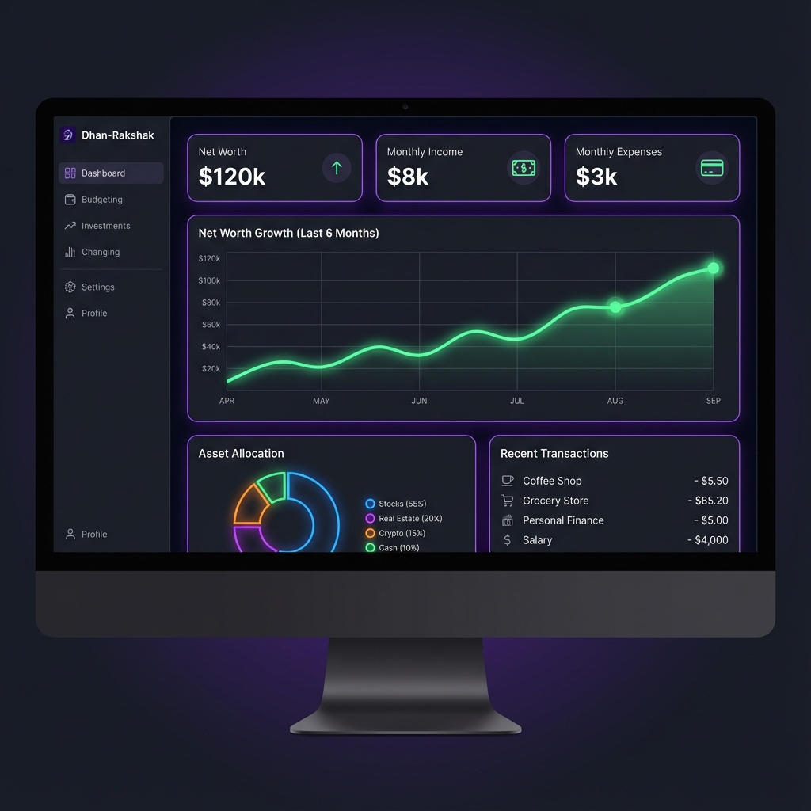
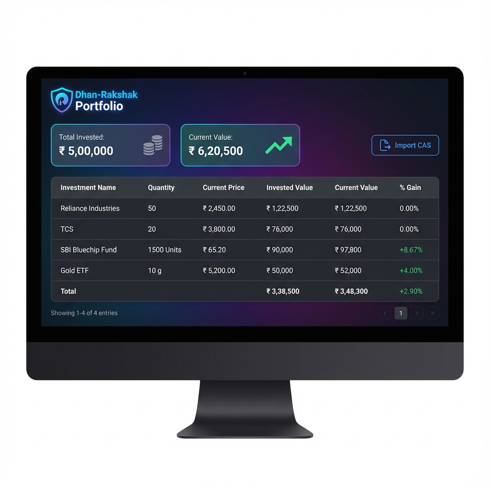
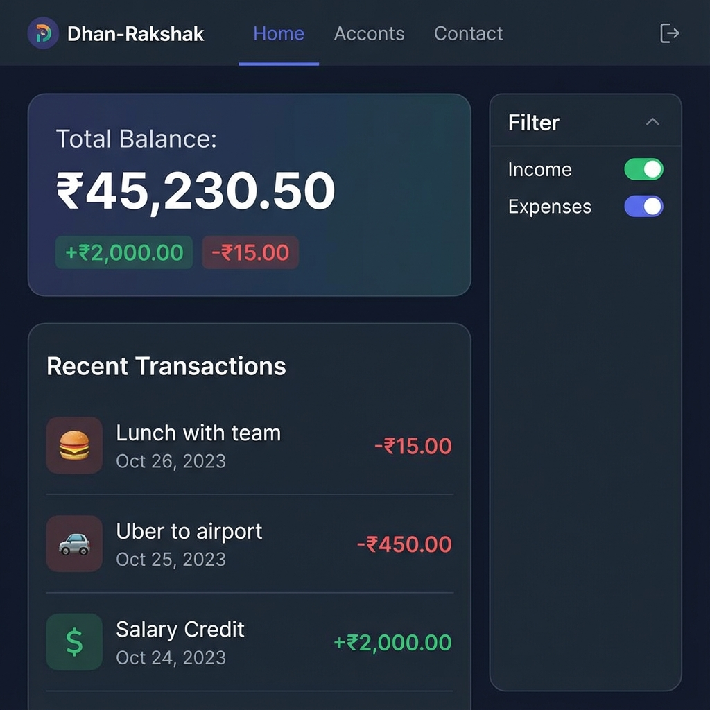
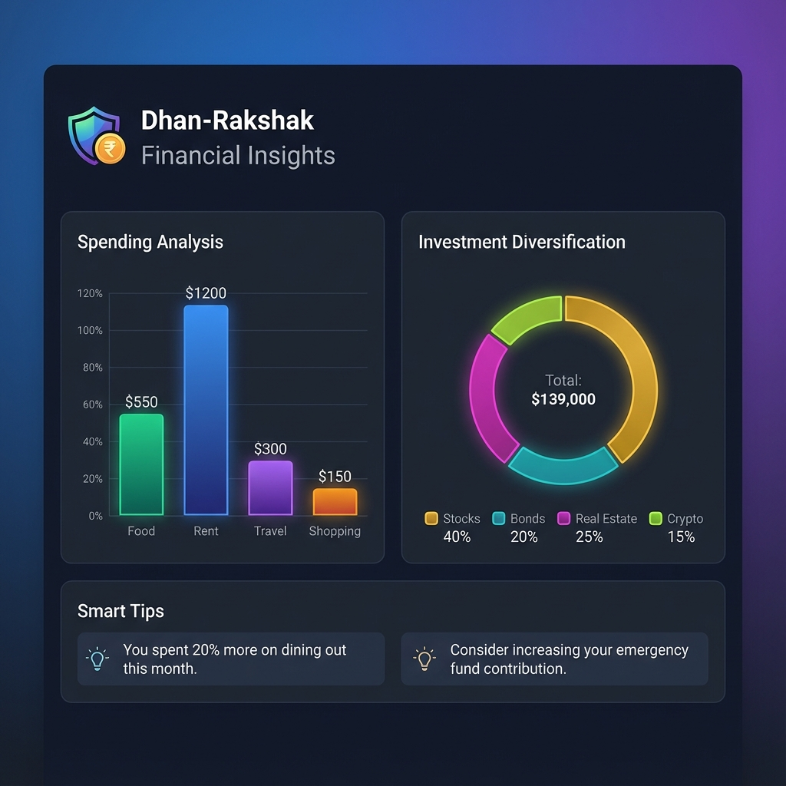
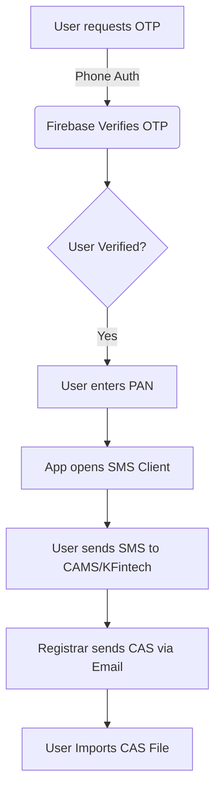

# 💰 Dhan-Rakshak Web App

   

**Dhan-Rakshak** (Wealth Protector) is a comprehensive, privacy-first personal finance management application tailored for the Indian market. It leverages the power of the **India Stack** (Digital Infrastructure) to provide seamless tracking of stocks, mutual funds, expenses, and financial goals.

**Key Philosophy**: Local-First Data. Your financial data belongs to you and is primarily stored on your device.

---

## 🌟 Key Features

### 📊 Comprehensive Dashboard

- **Net Worth Tracking**: Real-time calculation of your total wealth.
- **Activity Feed**: Recent transactions and portfolio changes.
- **Asset Allocation**: Visual breakdown of your portfolio (Equity, Debt, Gold).

### 📈 Smart Portfolio Management

- **Live Market Data**: Real-time prices for **Stocks (NSE/BSE)** via Yahoo Finance and **Crypto** via CoinGecko.
- **Mutual Funds**: Daily NAV updates directly from AMFI.
- **Multi-Asset Support**: Track Stocks, Mutual Funds, Gold, Crypto, EPF, and PPF.
- **Automated Calculations**: Instant gains/loss analysis.

### 📥 One-Click Imports & Automation
- **📝 CAS Import**: Import your *entire* mutual fund history by uploading your **Consolidated Account Statement (CAS)** from CAMS or KFintech.
- **📲 OTP-Based Fetch**: (Experimental) Fetch your portfolio using just your mobile number and OTP verification.
- **🔒 Privacy**: Parsing happens entirely in your browser. No financial data is sent to our servers during import.

### 💳 Transactions & Budgeting

- **Smart Categorization**: Tag income and expenses.
- **Recurring Transactions**: Set up subscriptions and bills.
- **Budget Tracking**: Monitor spending against monthly limits.

### ☁️ Cloud Sync (Optional)
- **Multi-Device Support**: Sync your data across Mobile, Tablet, and Desktop.
- **Firebase Backend**: Secure, encrypted storage using your Google/Microsoft account.
- **Offline First**: Works perfectly without internet; syncs when you go online.

### 🤖 AI Insights

- **Risk Analysis**: AI-powered assessment of your portfolio diversification.
- **Financial Advice**: Personalized tips based on your spending and saving patterns.

---

## 🛠️ Technology Stack

- **Frontend**: [Vue.js 3](https://vuejs.org/) (Composition API)
- **Build Tool**: [Vite](https://vitejs.dev/)
- **Language**: [TypeScript](https://www.typescriptlang.org/)
- **State Management**: [Pinia](https://pinia.vuejs.org/)
- **Local Database**: [Dexie.js](https://dexie.org/) (IndexedDB wrapper)
- **Cloud Backend**: [Firebase](https://firebase.google.com/) (Auth, Firestore)
- **Styling**: [TailwindCSS](https://tailwindcss.com/)
- **Charts**: [Chart.js](https://www.chartjs.org/)

---

## 🚀 Getting Started

### Prerequisites
- Node.js (v18 or higher)
- npm (v9 or higher)

### Installation

1.  **Clone the repository**
    ```bash
    git clone https://github.com/yourusername/dhan-rakshak-web.git
    cd dhan-rakshak-web
    ```

2.  **Install Dependencies**
    ```bash
    npm install
    ```

3.  **Run Locally**
    ```bash
    npm run dev
    ```
    Access the app at `http://localhost:5173`.

### Build for Production
```bash
npm run build
```

---

## ⚙️ Configuration

### Firebase Setup (Required for Auth & Cloud Sync)

To enable Login and Cloud Sync, you need a Firebase project.

1.  **Create Project**: Go to [Firebase Console](https://console.firebase.google.com/) and create a new project.
2.  **Enable Auth**:
    *   Go to **Authentication** > **Sign-in method**.
    *   Enable **Google** and/or **Microsoft** providers.
    *   (Optional) Enable **Phone** provider for OTP features.
3.  **Create Web App**:
    *   Go to **Project Settings** > **General** > **Your apps**.
    *   Register a web app (e.g., "Dhan-Rakshak Web").
    *   Copy the `firebaseConfig` object.
4.  **Configure App**:
    *   Copy the `.env.example` file to a new file named `.env`:
        ```bash
        cp .env.example .env
        ```
    *   Open `.env` and fill in your Firebase configuration values:
        ```env
        VITE_FIREBASE_API_KEY=your_api_key
        VITE_FIREBASE_AUTH_DOMAIN=your_project.firebaseapp.com
        VITE_FIREBASE_PROJECT_ID=your_project_id
        VITE_FIREBASE_STORAGE_BUCKET=your_project.appspot.com
        VITE_FIREBASE_MESSAGING_SENDER_ID=your_sender_id
        VITE_FIREBASE_APP_ID=your_app_id
        ```
    > **Note**: The `.env` file is gitignored to keep your secrets safe. Never commit this file to version control.

---

## 📖 Usage Guide

### 1. Importing Mutual Funds (CAS)
This is the easiest way to onboard.
1.  Request your **Detailed CAS** from [CAMS Online](https://www.camsonline.com) or [KFintech](https://www.kfintech.com).
2.  You will receive it via email. Save the attachment/content as a `.txt` file (if it's not a PDF protected one, or use the text version).
3.  In the app, go to **Portfolio** > **Import MF**.
4.  Select the file. The app will parse it locally and populate your portfolio.

### 2. Live Data Setup
- **Stocks**: When adding a stock, use the Yahoo Finance symbol format.
    - Reliance: `RELIANCE.NS`
    - TCS: `TCS.NS`
- **Mutual Funds**: Use the AMFI Scheme Code (e.g., `120503` for SBI Bluechip).
- **Refresh**: Click the **Refresh Prices** button to fetch the latest market data.

### 3. OTP Fetch Flow (Experimental)
This feature attempts to automate the CAS request process via SMS.


---

## 🔒 Privacy & Security

Dhan-Rakshak is designed with a **privacy-first** architecture:
- **Local Storage**: Your sensitive financial data (transactions, portfolio holdings) is stored in `IndexedDB` on your browser.
- **Client-Side Processing**: CAS file parsing happens entirely in the browser memory. No file is ever uploaded to a server.
- **Encrypted Sync**: If you use Cloud Sync, data is encrypted in transit and at rest using Firebase security rules. Access is strictly limited to your authenticated user ID.

---

## 🤝 Contributing

Contributions are welcome! Please feel free to submit a Pull Request.

1.  Fork the Project
2.  Create your Feature Branch (`git checkout -b feature/AmazingFeature`)
3.  Commit your Changes (`git commit -m 'Add some AmazingFeature'`)
4.  Push to the Branch (`git push origin feature/AmazingFeature`)
5.  Open a Pull Request

---
